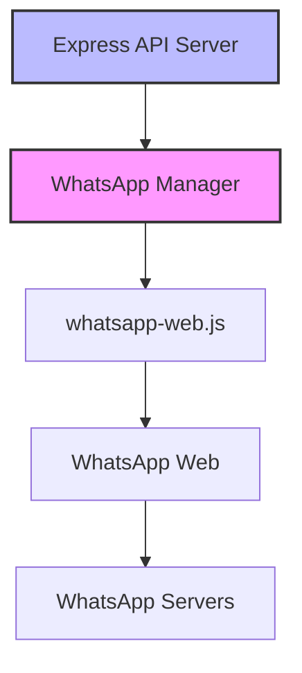

# WhatsApp Manager

A comprehensive solution for managing WhatsApp clients through a REST API using the [whatsapp-web.js](https://wwebjs.dev/) library.

## Overview

WhatsApp Manager provides a simple way to interact with WhatsApp Web through a Node.js application. It consists of two main components:

1. **WhatsApp Manager Module** (`whatsappManager.js`) - A singleton module that handles WhatsApp client management
2. **Express API Server** (`express-example.js`) - A RESTful API that exposes the WhatsApp Manager functionality



## Getting Started

### Prerequisites

- Node.js (v12 or higher)
- npm
- A WhatsApp account on your phone

### Installation

1. Clone this repository or copy the files to your project
2. Install dependencies:

```bash
npm install
```

### Running the Express Server

```bash
# Run with Node.js
npm start

# Run with Nodemon for development (auto-restart on file changes)
npm run dev
```

This will start an Express server on port 3000 (or the port specified in your environment variables).

## Understanding the WhatsApp Manager

### Key Concepts

#### Phone Number vs Client ID

- **phoneNumber**: The user's phone number in international format (e.g., '+1234567890')
- **clientId**: Internally used identifier derived from phoneNumber by removing the '+' prefix (e.g., '1234567890')

The WhatsApp Manager uses clientId internally for tracking clients, while the Express API uses phoneNumber for a more intuitive interface.

#### Session Management

Sessions are automatically saved using LocalAuth in the `./sessions/{clientId}` directory. This allows clients to reconnect without scanning the QR code again.

#### Authentication Flow

1. Client requests a QR code via the API
2. User scans the QR code with their WhatsApp mobile app
3. WhatsApp Web authenticates the session
4. The client is now ready to send and receive messages

## Express API Server

The Express server (`express-example.js`) provides a RESTful API for interacting with WhatsApp. Here's a breakdown of the available endpoints:

### Status Endpoint

```
GET /status
```

Checks the connection status of the active WhatsApp client.

**Response:**
```json
{
  "status": "connected",
  "phoneNumber": "+1234567890"
}
```

### QR Code Endpoint

```
GET /qr?phone=+1234567890
```

Generates a QR code for authenticating a WhatsApp client.

**Parameters:**
- `phone`: Phone number in international format (with country code)

**Response:**
```json
{
  "success": true,
  "authenticated": false,
  "qr": "data:image/png;base64,...",
  "message": "QR code generated successfully"
}
```

### Authentication Status Endpoint

```
GET /auth-status
```

Checks if the client is authenticated.

**Response:**
```json
{
  "success": true,
  "authenticated": true,
  "requiresQR": false,
  "error": null,
  "phoneNumber": "+1234567890"
}
```

### Last 10 Messages Endpoint

```
GET /last10messages/:phoneNumber
```

Retrieves the last 10 messages for a specific client.

**Parameters:**
- `phoneNumber`: Phone number in international format (URL parameter)

**Response:**
```json
{
  "success": true,
  "messages": [
    {
      "id": "message-id",
      "from": "sender-id",
      "to": "recipient-id",
      "body": "Hello, world!",
      "timestamp": 1615123456789,
      "fromMe": false,
      "hasMedia": false,
      "type": "chat"
    },
    // ... more messages
  ]
}
```

### Send Message Endpoint

```
POST /send-message
```

Sends a message from one client to a recipient.

**Request Body:**
```json
{
  "senderPhoneNumber": "+1234567890",
  "recipientPhoneNumber": "+0987654321",
  "message": "Hello from WhatsApp Manager!"
}
```

**Response:**
```json
{
  "success": true,
  "message": "Message sent successfully"
}
```

### Logout Endpoint

```
POST /logout?phone=+1234567890
```

Logs out a WhatsApp client.

**Parameters:**
- `phone`: Phone number in international format (query parameter)

**Response:**
```json
{
  "success": true,
  "message": "Logged out successfully"
}
```

## Example API Usage

### Using curl

```bash
# Check status
curl http://localhost:3000/status

# Get QR code for login (replace with your phone number)
curl http://localhost:3000/qr?phone=+1234567890

# Check authentication status
curl http://localhost:3000/auth-status

# Get last 10 messages
curl http://localhost:3000/last10messages/+1234567890

# Send a message
curl -X POST http://localhost:3000/send-message \
  -H "Content-Type: application/json" \
  -d '{"senderPhoneNumber":"+1234567890", "recipientPhoneNumber":"+0987654321", "message":"Hello from API!"}'

# Logout
curl -X POST http://localhost:3000/logout?phone=+1234567890
```

### Using JavaScript (fetch)

```javascript
// Get QR code
async function getQRCode(phoneNumber) {
  const response = await fetch(`http://localhost:3000/qr?phone=${phoneNumber}`);
  const data = await response.json();
  
  if (data.success && data.qr) {
    // Display QR code to user
    console.log('Scan this QR code with your WhatsApp app:', data.qr);
  } else if (data.authenticated) {
    console.log('Already authenticated!');
  }
}

// Send a message
async function sendMessage(sender, recipient, message) {
  const response = await fetch('http://localhost:3000/send-message', {
    method: 'POST',
    headers: {
      'Content-Type': 'application/json'
    },
    body: JSON.stringify({
      senderPhoneNumber: sender,
      recipientPhoneNumber: recipient,
      message: message
    })
  });
  
  const data = await response.json();
  console.log(data.message);
}
```

## WhatsApp Manager API Reference

The WhatsApp Manager module (`whatsappManager.js`) provides the following methods:

### initialize()

Initializes the WhatsApp Manager singleton.

```javascript
whatsappManager.initialize();
```

### getLoginQR(phoneNumber, options)

Generates a QR code for authenticating a WhatsApp client.

```javascript
const { qr, authenticated, clientId } = await whatsappManager.getLoginQR('+1234567890');
```

**Parameters:**
- `phoneNumber`: Phone number in international format
- `options` (optional): Configuration options
  - `sessionDir`: Custom session directory

**Returns:**
- Object containing:
  - `qr`: QR code data (null if already authenticated)
  - `clientId`: Formatted phone number
  - `authenticated`: Whether the client is already authenticated

### isAuthenticated(phoneNumber)

Checks if a client is authenticated.

```javascript
const authenticated = whatsappManager.isAuthenticated('+1234567890');
```

**Parameters:**
- `phoneNumber`: Phone number in international format

**Returns:**
- Boolean indicating authentication status

### sendMessage(phoneNumber, recipient, content)

Sends a message from a client to a recipient.

```javascript
await whatsappManager.sendMessage('+1234567890', '0987654321', 'Hello!');
```

**Parameters:**
- `phoneNumber`: Sender's phone number in international format
- `recipient`: Recipient's phone number
- `content`: Message content (string for text, object for media)

**Returns:**
- Message info if sent successfully, null otherwise

### logout(phoneNumber)

Logs out a WhatsApp client.

```javascript
await whatsappManager.logout('+1234567890');
```

**Parameters:**
- `phoneNumber`: Phone number in international format

**Returns:**
- Boolean indicating success

### onMessage(callback)

Sets a global message handler for all clients.

```javascript
whatsappManager.onMessage((message) => {
  console.log('New message:', message);
});
```

**Parameters:**
- `callback`: Function to handle incoming messages

**Returns:**
- Boolean indicating success

### getLast10Messages(phoneNumber)

Gets the last 10 messages for a client.

```javascript
const messages = await whatsappManager.getLast10Messages('+1234567890');
```

**Parameters:**
- `phoneNumber`: Phone number in international format

**Returns:**
- Array of messages or null if client not found/authenticated

## Advanced Features

### Working with Multiple Clients

The WhatsApp Manager can handle multiple clients simultaneously. Each client is identified by its phone number. You can create and manage multiple clients through the API:

```javascript
// Initialize multiple clients
await whatsappManager.getLoginQR('+1234567890');
await whatsappManager.getLoginQR('+0987654321');

// Send messages from different clients
await whatsappManager.sendMessage('+1234567890', 'recipient1', 'Hello from client 1');
await whatsappManager.sendMessage('+0987654321', 'recipient2', 'Hello from client 2');
```

### Handling Different Message Types

The WhatsApp Manager supports different message types:

#### Text Messages

```javascript
await whatsappManager.sendMessage('+1234567890', 'recipient', 'Hello, world!');
```

#### Image Messages

```javascript
await whatsappManager.sendMessage('+1234567890', 'recipient', {
  image: 'https://example.com/image.jpg',
  caption: 'Check out this image!'
});
```

## Troubleshooting

### QR Code Issues

- Make sure your phone has an active internet connection
- Ensure your phone's WhatsApp app is up to date
- Try clearing the session directory and generating a new QR code

### Authentication Problems

- If authentication fails, try logging out and generating a new QR code
- Check if your WhatsApp account is active on your phone
- Ensure you're not using WhatsApp Web in too many places (there's a limit)

### Message Delivery Errors

- Verify that the recipient's phone number is correct and active on WhatsApp
- Check your internet connection
- Ensure the client is properly authenticated

## Security Considerations

- Store session data securely
- Implement proper authentication for your API
- Be mindful of WhatsApp's terms of service and usage policies
- Don't use this for spam or unauthorized messaging

## License

This project is licensed under the MIT License - see the LICENSE file for details.
